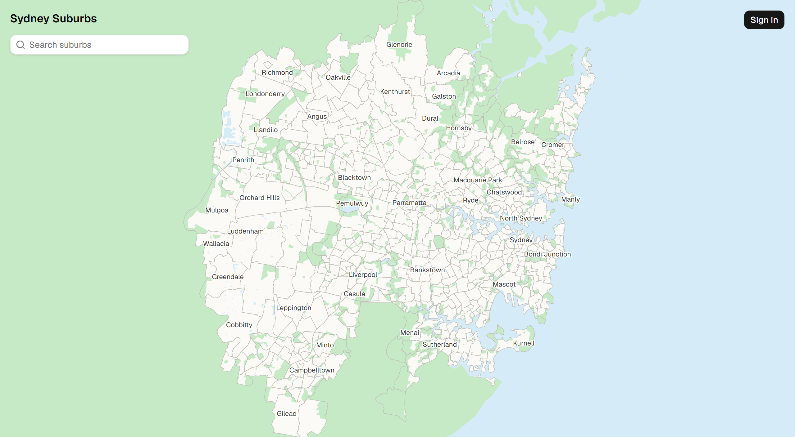

# Sydney Suburbs

Track which Sydney suburbs you've visited.

- A pannable, zoomable map of Greater Sydney's 648 suburbs, from Penrith to Berowra to Campbelltown
- Click a suburb to select it and mark it visited
- Keep notes and a visit date for each suburb
- See your progress, e.g. "142 / 648 suburbs"
- Anyone can browse the map
- Sign in with Google to track your visits across devices

## Tech Stack

- **Frontend:** Vite, React 19, TypeScript, TanStack Router and Query, Tailwind CSS, shadcn/ui (Base UI)
- **Map:** SVG drawn with d3-geo and d3-zoom from a TopoJSON file
- **API:** Hono in a Vercel Function
- **Auth:** Better Auth with Google sign-in
- **Database:** Neon Postgres with Drizzle ORM
- **Hosting:** Vercel

## Data

Suburb boundaries come from the ABS Australian Statistical Geography Standard (ASGS) Edition 3, licensed under [CC BY 4.0](https://creativecommons.org/licenses/by/4.0). The area is the ABS Greater Sydney region minus the Blue Mountains, Central Coast, Oberon and Wollondilly councils, national parks, and the rural fringe. Parks come from ABS Mesh Blocks, and rivers and lakes from NSW Spatial Services Hydro Area. Label priority follows the strategic centres in the NSW Greater Sydney Region Plan.
